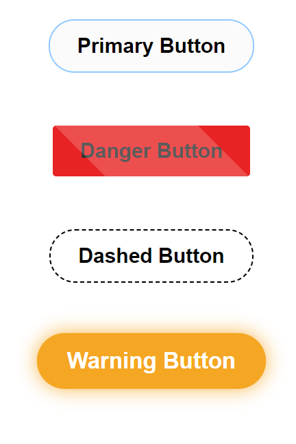

# va-button-ui


## Image
" />

> Made with create-react-library

[](https://www.npmjs.com/package/va-button-ui) [](https://standardjs.com)


## Install

```bash
npm install --save va-button-ui
```

## Usage

```jsx
import React, { Component } from 'react'

import MyComponent from 'va-button-ui'
import 'va-button-ui/dist/index.css'

class Example extends Component {
  render() {
    return <MyComponent />
  }
}
```

## License

MIT © [Vildan1](https://github.com/Vildan1)
